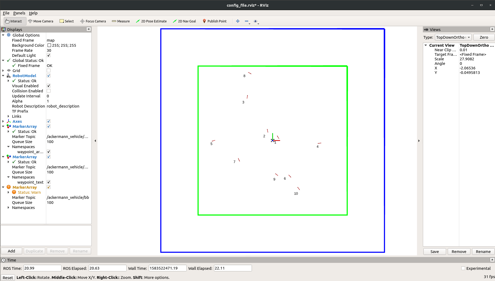

16-745 Optimal Control and Reinformcement Learning : Homework 2 
==================================================

The goal of the assignment is to generate a local policy that drives an Ackermann system to a sequence of waypoints `(x, y, theta)` in the shortest time possible while respecting the dynamics (non-holonomic) and control saturation (velocity, acceleration and steering angle limits). The homework is open-ended and there is no restriction on the type of Optimal Control/RL/Planning/Learning methods you can use to achieve this task. 

## Software
This homework requrires setting up Robot Operating System (ROS) and Gazebo environments. 

### Requriements
- Ubuntu 14.04 or later
- ROS Indigo or later
- Gazebo 7 or later

### Setting up the workspace
Get this repository in a catkin workspace. The suggested location is `~/catkin_ws/src/`, but any valid catkin worskspace source folder will work. We suggest forking over and cloning as you will be working with the code.

#### Additional requirements
The following ROS packages might need to be installed. 
```
effort_controllers
joint_state_publisher
ackermann_msgs
``` 
The above ROS packages can be installed with the below command
```
sudo apt-get install ros-<ros_distro_name>-<package_name with '_' replaced with '-'>
```
In case any other ROS packages are missing use the above command to install it. 

### Compilation and Running
```
cd ~/catkin_ws
catkin_make
```
_Note:_ If you are unfamiliar with catkin, please know that you must run `source ~/catkin_ws/devel/setup.sh` before ROS will be able to locate the ocrl packages. This line can be added to your `~/.bashrc` file so that it is automatically run on opening a terminal. 

### Testing the Simulation and Visualization
Run the following launch file to invoke the simulator, visualization and ordered set of waypoints to navigate to in the shortest time. Running this launch file will be first step of the planner you are going to develop
```
roslaunch ocrl ocrl.launch
```
Running the above command should open the following RViz window with a set of randomly chosen waypoints

The numbered red arrows are the waypoints in order to be reached by the robot. The green boundary denotes the limits of X (from -10 to 10 in meters) and Y axis (from -10 to 10 in meters) from which a waypoint might be chosen, the robot can go out of this boundary to reach a waypoint. The blue boundary is the harder boundary beyond which the robot is expected to not go. 

_Note:_ The Gazebo is running in the non-gui mode (only gzserver is running). Enable the `gui` flag for `gazebo_ros` node in `ackermann_vehicle_gazebo/launch/ackermann_vehicle.launch` to open Gazebo gui. Functionally, this will only slow down your graphics. 
 

Once the environment is ready, you can launch your planner. As an example, we have provided a pure pursuit planner/controller (below command) that drives to the set of ordered waypoints. Note that the behavior is very reactive and it does a pretty bad job in reaching all those waypoints. **You guys should be able to design a planner that does much better than this!!!**
```
rosrun ocrl pure_pursuit.py
```

### Question
Generate a local policy that drives an Ackermann system to a sequence of waypoints `(x, y, theta)` in the shortest time possible while respecting the dynamics (non-holonomic) and control saturation (velocity, acceleration and steering angle limits).

Our robot can be modeled with bicycle dynamics. The two control signals are the steering wheel angle
and the linear acceleration with respect to the base link. A few parameters you might need for designing the planner are listed below

#### Parameters
- Wheelbase = 0.335m
- Min turning radius = 0.67m
- Max steering angle = 30 deg
- Max acceleration = 4m/s^2
- Max deceleration = -4m/s^2
- Max waypoints = 10
- Waypoint tol = 0.2m
- Waypoint ang tol = 5 deg

`Wheelbase` is the distance between the centers of the front and rear wheels. `Min turning radius` is calculated using the wheelbase and the maximum turn angle of the front wheel (or the `max steering angle`). `Waypoint tol` is the radius around a waypoint into which the vehicle should enter with a heading error of +/-`Waypoint ang tol` to be considered as reaching a waypoint. 

#### Integration 
* Subscribe to the list of waypoints from the topic `/ackermann_vehicle/waypoints` of type `geometry_msgs/PoseArray`. You can check `ocrl/scripts/pure_pursuit.py` for an example of subscribing to the waypoints
* Publish your trajectory in the form of Ackermann command to `/ackermann_vehicle/ackermann_cmd` topic of type `ackermann_msgs/AckermannDriveStamped`. 
    * For visualization, you can control the car using the velocity with respect to the base link and the steerimg angle. This means you just have to publish the `drive.speed` and `drive.steering_angle` fields of `/ackermann_vehicle/waypoints` topic to visualize the robot. Note that you might be planning in the space of control inputs (acceleration with respect to the base link) and you need to convert that to velocity for visualization. 

### What to turn in?

You can use C++/Python/Matlab for this assignment. You will have to stick to the API conventions provided in the **Integration** section. If you prefer to use a different API, then make sure you bundle them all up to a single launch file and provide instructions so that I can test it seamlessly. You can work in groups of size upto 5 (please prefer working in groups and make sure to have at least one person per team with a working knowledge of ROS). 

Submit a writeup explaining your method both technically and at a high-level that explains the reason for choosing any particular strategy. Include links to your source and any compiled code in either .zip, .tar, or .tar.gz format. The writeup is more important than the code. What did you do? Why did it work? What didn't work and why? Be sure to list the names of all the members of your group in the writeup.

Please submit the writeup and code via Gradescope. 


